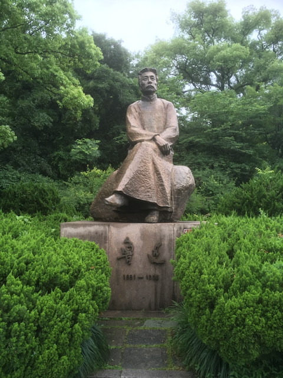

# 派彩虹效果
## 介绍
把一张照片：



改为这张：


## 马上开始
* 把软件包安装：

```
pip install pychedelic
```

### Python应用程序接口
在Python直译器把派彩虹效果包进口：

```python
>>> import pyrainboweffect
```

塗这个效果对图片档案就把结果保存为GIF：

```python
>>> pyrainboweffect.psychedelic_gif('input.png', 'output.gif')
```

塗这个效果对图片档案就把结果保存为MP4：

```python
>>> pyrainboweffect.psychedelic_mp4('input.png', 'output.gif')
```

### 命令行界面
为使用命令行界面：

```bash
$ python -m pyrainboweffect input.png output.gif
```

## 应用程序接口
[点击这里](api_documentation.md)阅读大全应用程式界面指南。目前这本指南只有英文版。

## 运转原理
这个效果可以被产生如下：
1. 改原来图片为灰度。
2. 划分强度空间所以分的数量和配色颜色的数量一样。
3. 把强度区改为它们配合的颜色。
4. 增加原来的图片每个像素的强度（重启像素强度为零如果溢出发生）。
5. 回去第二步就重复直到已处理的图片够为创造动画。

## 软件包依赖
本软件包支持Python版本大于等于3.5。应该能用在任何可移植作业系统还能用在视窗操作系统版本大于等
于七。

以下的Pypi包为要求：
* moviepy
* numpy
* opencv-python

## 怎么投稿
我欢迎建议与pull requests。如果您发现程序错误与没有时间自己修改请在Git上开问题。

## 未来作业
- 能力塗彩虹效果在动画GIF或者视频上。
